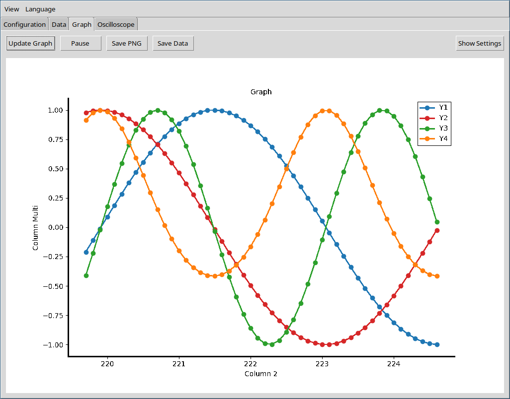

<b>Lim Terminal</b> — Serial communication and real‑time data visualization.

  <a href="docs/README_en.md">EN</a> ·
  <a href="docs/README_pt-br.md">PT‑BR</a> ·
  <a href="docs/README_es.md">ES</a> ·
  <a href="docs/README_de.md">DE</a> ·
  <a href="docs/README_fr.md">FR</a>

---

- Download the latest release: [https://github.com/CBPF-LIM/lim_term/releases]()
- Full manual: [docs/manual/en/index.md]()
