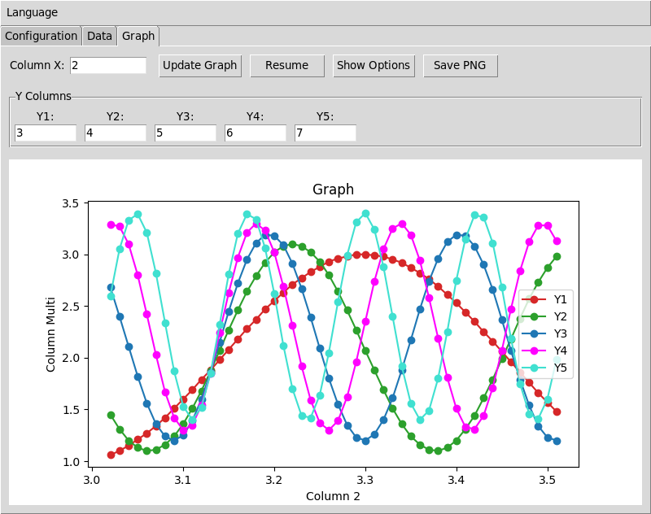

# LIM Serial - Serial Communication & Data Visualization GUI

**README in:** [English](README.md) | [Português](docs/README_pt-br.md) | [Español](docs/README_es.md) | [Deutsch](docs/README_de.md) | [Français](docs/README_fr.md)

---

## Overview

LIM Serial is a modern, internationalized GUI application for serial communication and real-time data visualization. Built with Python/Tkinter and matplotlib, it provides a user-friendly interface for connecting to serial devices, collecting data, and creating dynamic graphs.



## Features

### 🌍 **Internationalization**
- **5 Languages**: English, Portuguese (Brazil), Spanish, German, French
- **Real-time Language Switching**: Change language without restarting
- **Persistent Preferences**: Language selection saved automatically
- **YAML-based Translations**: Easy to extend with new languages

### 📡 **Serial Communication**
- **Hardware Mode**: Connect to real serial ports
- **Simulated Mode**: Built-in virtual port with data generation
- **Auto-detection**: Automatic port discovery and refresh
- **Flexible Baudrate**: Support for all standard baudrates
- **Real-time Status**: Connection information with visual feedback

### 📊 **Data Visualization**
- **Multiple Graph Types**: Line, Bar, Scatter plots
- **Real-time Updates**: Live data plotting with configurable refresh
- **Customizable Appearance**: 20+ colors, 10+ marker types
- **Axis Control**: Manual Y-axis limits and windowing
- **PNG Export**: Save graphs as high-quality images
- **Pause/Resume**: Control data flow without disconnecting

### 💾 **Data Management**
- **Save/Load**: Export and import data in text format
- **Autosave**: Automatic data backup with user confirmation
- **Clear Function**: Reset data with safety prompts
- **Persistent Settings**: All preferences saved between sessions

### 🎨 **User Interface**
- **Tabbed Interface**: Organized Configuration, Data, and Graph tabs
- **Responsive Design**: Adaptive layout with proper widget sizing
- **Visual Feedback**: Status indicators and progress information
- **Accessibility**: Clear labeling and intuitive navigation

## Installation

### Requirements
- Python 3.7+
- tkinter (usually included with Python)
- matplotlib
- pyserial
- PyYAML

### Install Dependencies
```bash
pip install matplotlib pyserial PyYAML
```

### Quick Start
```bash
# Clone or download the project
cd lim_serial

# Run the application
python lim_serial.py
```

## Usage Guide

### 1. Configuration Tab
- **Mode Selection**: Choose between Hardware or Simulated mode
- **Port Selection**: Select from available serial ports (auto-refreshed)
- **Baudrate**: Set communication speed
- **Connect/Disconnect**: Establish or close serial connection

### 2. Data Tab
- **Real-time Display**: View incoming data in tabular format
- **Save Data**: Export current dataset to text file
- **Load Data**: Import previously saved data
- **Clear Data**: Reset current dataset
- **Autosave**: Automatic backup with user confirmation

### 3. Graph Tab
- **Column Selection**: Choose X and Y data columns for plotting
- **Graph Types**: Select Line, Bar, or Scatter plot
- **Customization**: Colors, markers, axis limits, window size
- **Export**: Save graphs as PNG images
- **Pause/Resume**: Control real-time updates

### 4. Language Menu
- **Language Selection**: Available in main menu bar
- **Real-time Switching**: Changes apply immediately
- **Persistent**: Language preference saved automatically

## Data Format

Serial data should be sent in space-separated columns:

```
# Header (optional)
timestamp voltage current temperature

# Data rows
1.0 3.3 0.125 25.4
2.0 3.2 0.130 25.6
3.0 3.4 0.122 25.2
```

**Features:**
- Space or tab-separated values
- Automatic column detection
- Numeric data parsing
- Header row support (ignored during plotting)

## Project Architecture

### Configuration Management
- **User Preferences**: Stored in `config/prefs.yml`
- **Tab-specific Settings**: Organized by interface section
- **Language Persistence**: Automatic language selection memory
- **Safe Defaults**: Fallback values for all preferences

### Translation System
- **YAML-based**: Human-readable translation files in `languages/`
- **Hierarchical Keys**: Organized by UI component and context
- **Fallback Support**: Missing translations fall back to English
- **Real-time Updates**: Interface updates immediately on language change

## Development

### Adding New Languages
1. Create new YAML file in `languages/` directory
2. Follow the structure of existing language files
3. Test all interface strings
4. Submit pull request

### Extending Functionality
- **Serial Protocols**: Extend `SerialManager` for custom protocols
- **Graph Types**: Add new plot types in `GraphManager`
- **Data Formats**: Implement custom parsers in `utils/`
- **UI Components**: Create new tabs following existing patterns

## Configuration Files

### User Preferences (`config/prefs.yml`)
```yaml
language: en
tabs:
  config:
    mode: Hardware
    port: "/dev/ttyUSB0"
    baudrate: "9600"
  graph:
    type: Line
    color: Blue
    marker: circle
    window_size: "100"
    x_column: "1"
    y_column: "2"
```

### Language Files (`languages/*.yml`)
Structured translation files with hierarchical organization by UI component.

## Contributing

1. Fork the repository
2. Create a feature branch
3. Make your changes
4. Test thoroughly (especially internationalization)
5. Submit a pull request

### Areas for Contribution
- New language translations
- Additional graph types
- Enhanced serial protocols
- UI/UX improvements
- Documentation improvements

## License

Developed by CBPF-LIM (Brazilian Center for Research in Physics - Light and Matter Laboratory).

## Support

For issues, feature requests, or questions:
- Check existing documentation
- Review translation files for UI strings
- Test with different languages and configurations
- Report bugs with detailed reproduction steps

---

**LIM Serial** - Modern serial communication made simple with international accessibility.
