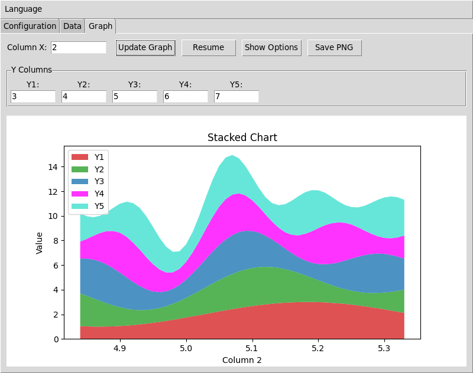

# Lim Terminal - Serielle Kommunikation & Datenvisualisierung

**README in:** [English](../README.md) | [Português](README_pt-br.md) | [Español](README_es.md) | [Deutsch](README_de.md) | [Français](README_fr.md)

---

## Übersicht

Lim Terminal ist eine benutzerfreundliche Anwendung für serielle Kommunikation und Echtzeit-Datenvisualisierung. Verbinden Sie Arduino oder andere serielle Geräte, sammeln Sie Daten und erstellen Sie dynamische Diagramme mit professionellen Visualisierungsfeatures. Verfügbar in 5 Sprachen mit automatischem Speichern der Einstellungen.




## Features

### 🌍 **Mehrere Sprachen**
- Verfügbar in Englisch, Portugiesisch, Spanisch, Deutsch und Französisch
- Sprachwechsel über das Menü (Neustart erforderlich)
- Alle Einstellungen bleiben beim Sprachwechsel erhalten

### 📡 **Einfache Serielle Verbindung**
- Verbindung zu echten seriellen Geräten (Arduino, Sensoren, etc.)
- Integrierter Simulationsmodus zum Testen ohne Hardware
- Automatische Port-Erkennung mit Ein-Klick-Aktualisierung
- Vollständige Kompatibilität mit Arduino IDE Baudraten (300-2000000 bps)

### 📊 **Professionelle Datenvisualisierung**
- **Zeitreihen-Diagramme**: Darstellung von bis zu 5 Datenspalten gleichzeitig
- **Gestapelte Flächendiagramme**: Vergleich von Daten als absolute Werte oder Prozentsätze
- **Anpassbares Aussehen**: Wählen Sie Farben, Marker und Linientypen für jede Datenreihe
- **Echtzeit-Updates**: Konfigurierbare Aktualisierungsraten (1-30 FPS)
- **Export**: Speichern Sie Diagramme als hochwertige PNG-Bilder
- **Interaktive Bedienelemente**: Pausieren/Fortsetzen der Datensammlung, Zoomen und Schwenken

### 💾 **Intelligente Datenverwaltung**
- **Manuelles Speichern/Laden**: Exportieren und importieren Sie Ihre Daten jederzeit
- **Automatische Sicherung**: Optionale automatische Speicherung mit zeitgestempelten Dateinamen
- **Datensicherheit**: Daten löschen mit Bestätigungsaufforderungen
- **Alle Einstellungen gespeichert**: Präferenzen werden automatisch zwischen Sitzungen gespeichert

## Erste Schritte

### Voraussetzungen
- Python 3.8 oder neuer
- Internetverbindung für die Installation von Abhängigkeiten

### Installation

#### Methode 1: Direkte Installation (Empfohlen)
```bash
# Direkt von GitHub installieren
pip install git+https://github.com/CBPF-LIM/lim_term.git

# Anwendung ausführen
limterm
```

#### Methode 2: Entwicklungsinstallation
```bash
# Repository klonen
git clone https://github.com/CBPF-LIM/lim_term.git
cd lim_term

# Mit Poetry installieren (empfohlen für Entwicklung)
pip install poetry
poetry install
poetry run limterm
```

### Windows Ausführbare Datei

Für Windows-Benutzer, die Python nicht installieren möchten:

1. **Download**: Laden Sie die neueste `LimTerm.exe` von [GitHub Releases](https://github.com/CBPF-LIM/lim_term/releases) herunter
2. **Ausführen**: Doppelklicken Sie auf die ausführbare Datei - keine Installation erforderlich
3. **Einstellungen**: Die App erstellt einen `lim_config` Ordner für Ihre Einstellungen

**Systemanforderungen:**
- Windows 10/11 (64-bit)
- Keine Python-Installation erforderlich
- ~50-100 MB Festplattenspeicher

### Erste Schritte
1. **Sprache**: Wählen Sie Ihre Sprache aus dem Sprachmenü
2. **Verbindung**: Gehen Sie zum Konfigurationsreiter, wählen Sie Ihren seriellen Port und die Baudrate
3. **Daten**: Wechseln Sie zum Datenreiter, um eingehende Daten zu sehen
4. **Visualisierung**: Verwenden Sie den Diagrammreiter, um Diagramme aus Ihren Daten zu erstellen

## Verwendung

### Konfigurationsreiter
- **Modus**: Wählen Sie "Hardware" für echte Geräte, "Simuliert" zum Testen
- **Port**: Wählen Sie Ihren seriellen Port (klicken Sie auf Aktualisieren, um die Liste zu aktualisieren)
- **Baudrate**: Stellen Sie die Kommunikationsgeschwindigkeit ein (entsprechend Ihren Geräteeinstellungen)
- **Verbinden**: Klicken Sie, um den Datenempfang zu starten

### Datenreiter
- **Daten anzeigen**: Sehen Sie eingehende Daten in Echtzeit-Tabellenformat
- **Daten speichern**: Exportieren Sie aktuelle Daten in eine Textdatei
- **Daten laden**: Importieren Sie zuvor gespeicherte Datendateien
- **Daten löschen**: Setzen Sie den aktuellen Datensatz zurück (mit Bestätigung)
- **Automatisch speichern**: Schalten Sie die automatische Sicherung mit zeitgestempelten Dateinamen ein/aus

### Diagrammreiter
- **Spalten auswählen**: Wählen Sie X-Achse und bis zu 5 Y-Achsen-Spalten aus Ihren Daten
- **Diagrammtypen**:
  - **Zeitreihen**: Individuelle Linien-/Streudiagramme für jede Datenreihe
  - **Gestapelte Fläche**: Geschichtete Diagramme mit kumulativen Daten oder Prozentsätzen
- **Anpassen**: Erweitern Sie "Erweiterte Optionen anzeigen", um Farben, Marker, Aktualisierungsrate zu ändern
- **Export**: Speichern Sie Ihre Diagramme als PNG-Bilder
- **Steuerung**: Pausieren/Fortsetzen von Echtzeit-Updates jederzeit

### Sprachmenü
- **Sprache wechseln**: Wählen Sie aus 5 verfügbaren Sprachen
- **Neustart erforderlich**: Die Anwendung fordert Sie auf, für den Sprachwechsel neu zu starten
- **Einstellungen erhalten**: Alle Ihre Präferenzen bleiben beim Sprachwechsel erhalten

## Datenformat

Ihr serielles Gerät sollte Daten im einfachen Textformat senden:

```
# Optionale Kopfzeile
timestamp voltage current temperature

# Datenzeilen (durch Leerzeichen oder Tab getrennt)
1.0 3.3 0.125 25.4
2.0 3.2 0.130 25.6
3.0 3.4 0.122 25.2
```

**Unterstützte Formate:**
- Durch Leerzeichen oder Tab getrennte Spalten
- Zahlen in beliebiger Spalte
- Optionale Kopfzeile (wird automatisch erkannt)
- Echtzeit-Streaming oder Batch-Datenladen

## Problembehandlung

**Verbindungsprobleme:**
- Stellen Sie sicher, dass Ihr Gerät angeschlossen und eingeschaltet ist
- Überprüfen Sie, dass kein anderes Programm den seriellen Port verwendet
- Versuchen Sie verschiedene Baudraten, wenn Daten verstümmelt erscheinen
- Verwenden Sie den Simulationsmodus, um die Oberfläche ohne Hardware zu testen

**Datenprobleme:**
- Stellen Sie sicher, dass Daten durch Leerzeichen oder Tab getrennt sind
- Überprüfen Sie, dass Zahlen im Standardformat vorliegen (verwenden Sie . für Dezimalstellen)
- Überprüfen Sie, dass Ihr Gerät kontinuierlich Daten sendet
- Versuchen Sie, Daten zu speichern und wieder zu laden, um das Format zu überprüfen

**Leistung:**
- Senken Sie die Aktualisierungsrate, wenn Diagramme langsam sind
- Reduzieren Sie die Datenfenstergröße für bessere Leistung
- Schließen Sie andere Programme, wenn das System nicht mehr reagiert

## Entwicklung

Diese Anwendung wurde mit Python entwickelt und verwendet tkinter für die Benutzeroberfläche und matplotlib für Diagramme.

**Für Entwickler:**
- Die Codebasis verwendet eine modulare Architektur mit separaten Komponenten für GUI, Datenverwaltung und Visualisierung
- Übersetzungen werden in YAML-Dateien im `languages/` Verzeichnis gespeichert
- Die Konfiguration verwendet ein hierarchisches Präferenzsystem, das in `config/prefs.yml` gespeichert wird
- Das Diagramm-Aktualisierungssystem ist für optimale Leistung von der Datenankunft entkoppelt

## Lizenz

Entwickelt von CBPF-LIM (Brasilianisches Zentrum für Physikforschung - Labor für Licht und Materie).

---

**Lim Terminal** - Professionelle serielle Kommunikation und Datenvisualisierung leicht gemacht.
