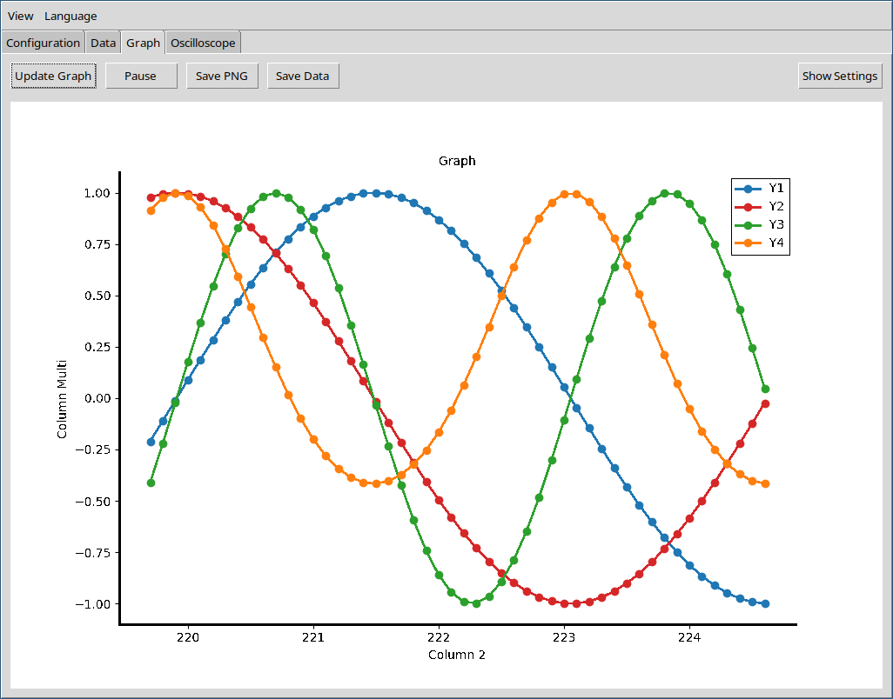

<b>Lim Terminal</b> — Serial communication and real‑time data visualization.

  <a href="README_en.md">EN</a> ·
  <a href="README_pt-br.md">PT‑BR</a> ·
  <a href="README_es.md">ES</a> ·
  <a href="README_de.md">DE</a> ·
  <a href="README_fr.md">FR</a>

---

Lim Terminal is a cross‑platform tool for serial communication and data visualization.

- Download: <a href="https://github.com/CBPF-LIM/lim_term/releases">https://github.com/CBPF-LIM/lim_term/releases</a>
- Full manual: <a href="manual/en/index.md">manual/en/index.md</a>

