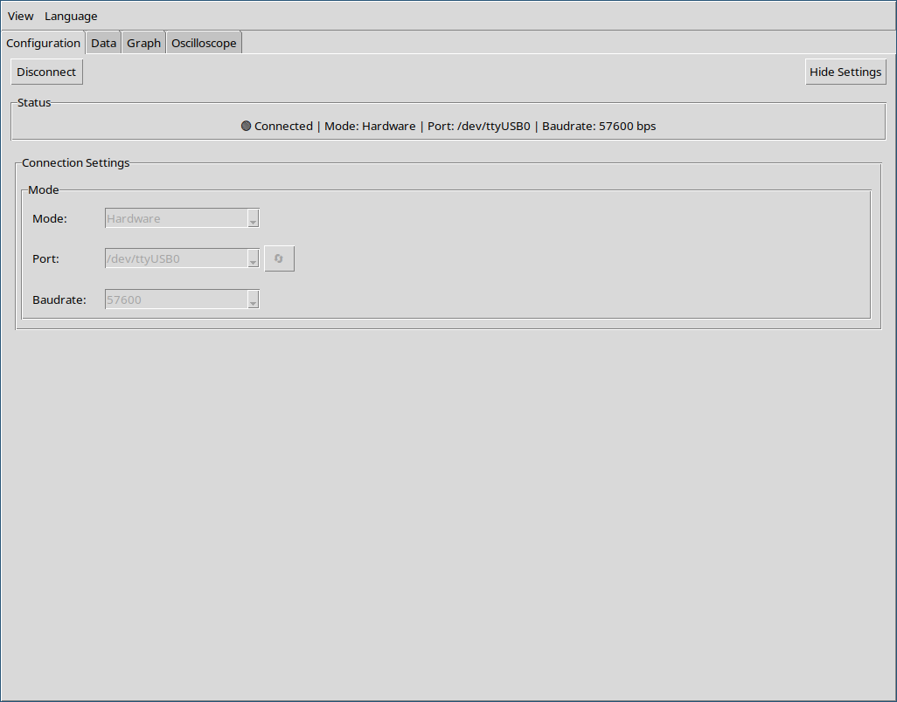
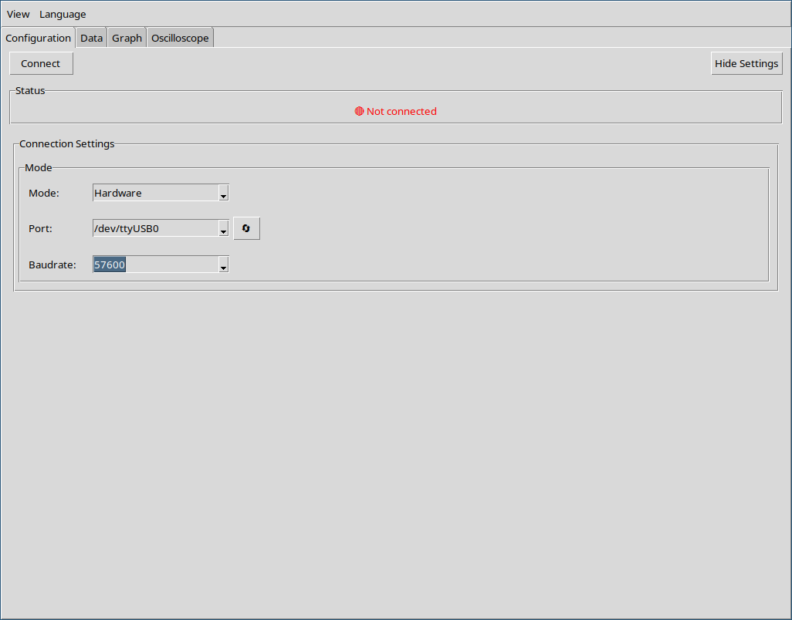
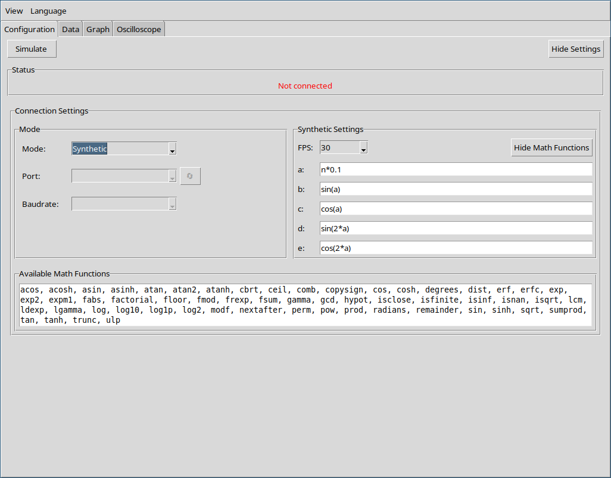

  <a href="index.md">Index</a> ·
  <a href="language.md">Prev</a> ·
  <a href="data.md">Next</a>

# Configuration

Use the Configuration tab to connect to real hardware or generate synthetic data.

## Hardware connection (Serial):

- Select the serial port and baudrate. Click refresh button (next to Port) to rescan ports.

### Security problems

- Linux (Ubuntu):
  - add your user to the dialout group and re‑login (IMPORTANT).
  - `$ sudo usermod -aG dialout "$USER"`
- macOS:
  - grant permission to USB/serial device when prompted.
- Windows:
  - drivers may be required (CH340/CP210x).
  - Close other apps using the port.

## Synthetic data:

Switch to Synthetic mode and define equations for columns. Useful for testing without hardware.

- Equations:
  - Use retro reference of `a`, `b`, `c` and `d`.
  - There is a hidden `n` counter, which is the index of the generated line.
  - Button to show all supported math functions.
  - Do not need to use, for example, `math.sin()`. Just use `sin()`.
- FPS control the line generation speed, which is (1000/FPS) milliseconds.

  <a href="index.md">Index</a> ·
  <a href="language.md">Prev</a> ·
  <a href="data.md">Next</a>

