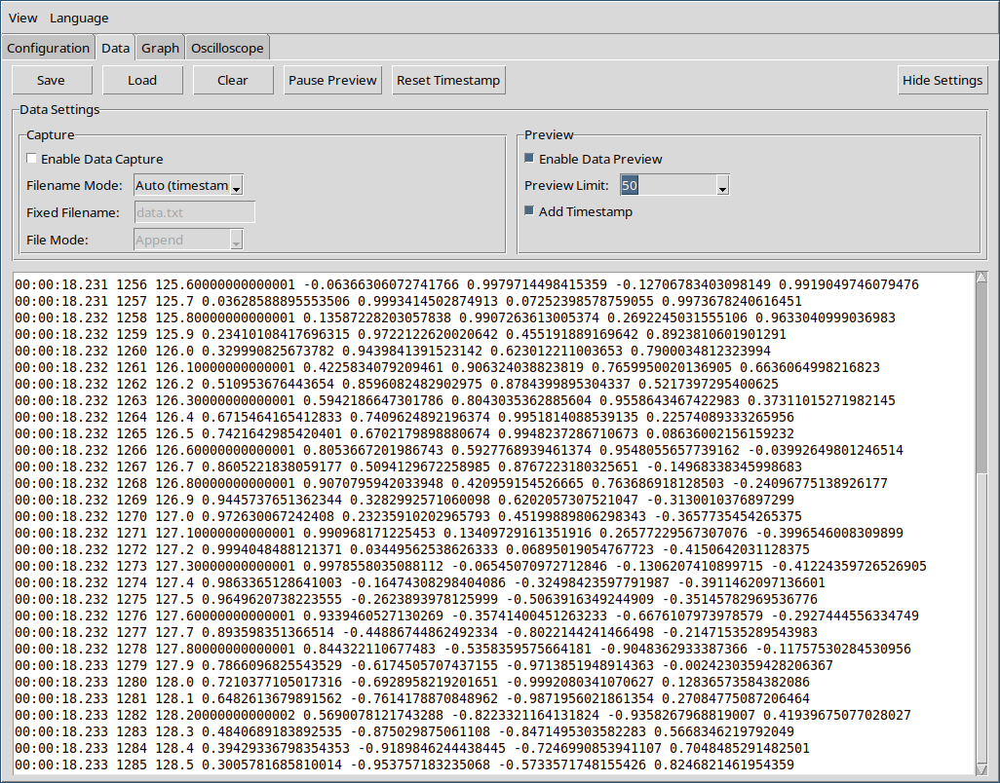

  <a href="index.md">Index</a> ·
  <a href="configuration.md">Prev</a> ·
  <a href="graph.md">Next</a>

# Data

## Preview
- Display incoming data rows in real time.
- Include a timestamp for each row in the preview.
- Limit the preview to show only the most recent results.
- Allow pausing the preview without interrupting data acquisition.

## Capture
- Enable saving data to a file.
- Filename Mode:
  - **Auto**: Automatically generate a filename using the current date.
  - **Fixed**: Specify a custom filename.
- File Mode:
  - **Append**: Add new data to the end of the existing file.
  - **Overwrite**: Replace the file contents with new data.

Load previously saved datasets. Loaded data is treated the same as incoming data.

  <a href="index.md">Index</a> ·
  <a href="configuration.md">Prev</a> ·
  <a href="graph.md">Next</a>

