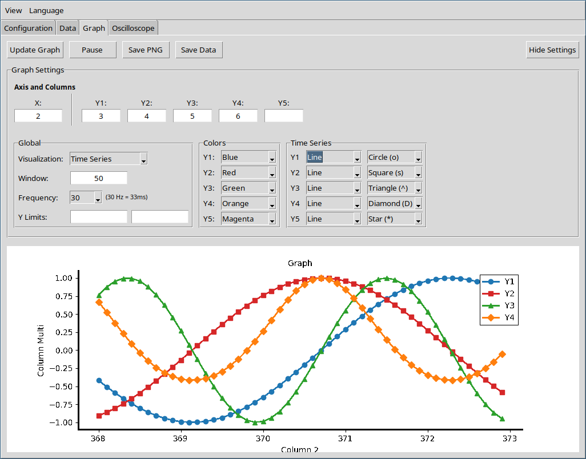
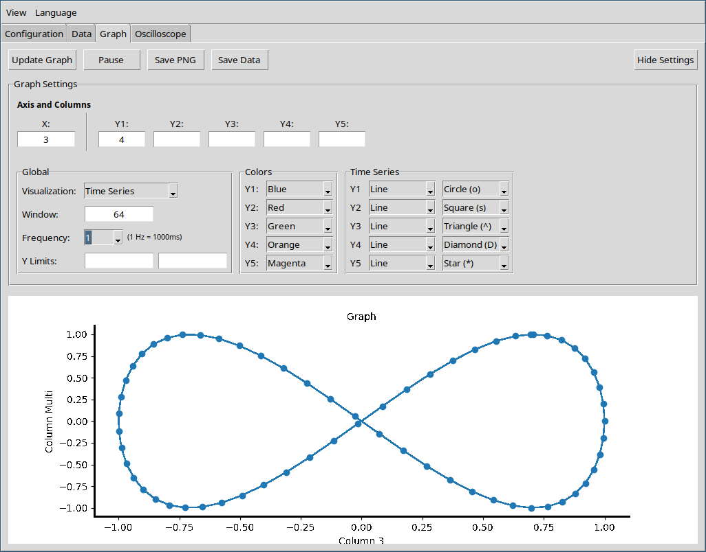

  <a href="index.md">Index</a> ·
  <a href="data.md">Prev</a> ·
  <a href="oscilloscope.md">Next</a>

# Graph

Each line of data is automatically split into columns and assigned an index. You can select any column as the X axis and one or more columns as Y axes for plotting.

## Settings

- **Data format:** Input must be line-based, with columns separated by spaces or tabs.
- **Axis selection:** Choose one column for the X axis and one or more columns for the Y axes.
- **Window size:** Set the number of most recent lines to display
- **Update frequency:** Chart refresh rate. This affects only the display, not the data, and can help reduce CPU usage.
- **Export options:**
  - Save the current chart as a PNG image
  - Export raw data as plain text
- **Customization:** Modify colors, markers, and line styles.

## XY Charts

Create XY plots by selecting any column for the X axis and one or more columns for the Y axes. This allows you to visualize relationships between variables, including non-functional or arbitrary shapes.

  <a href="index.md">Index</a> ·
  <a href="data.md">Prev</a> ·
  <a href="oscilloscope.md">Next</a>

