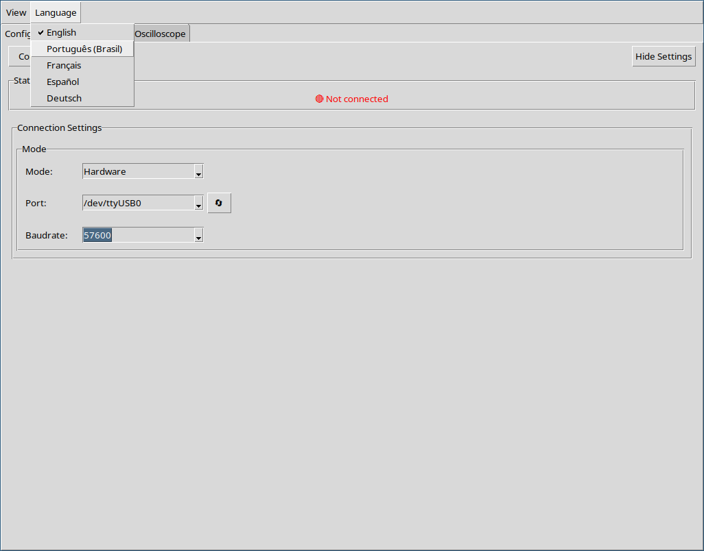

  <a href="index.md">Index</a> ·
  <a href="start.md">Prev</a> ·
  <a href="configuration.md">Next</a>

# Language

Lim Terminal supports 5 languages:

* English
* Portuguese (Brazil)
* Spanish
* German
* French

Select your language from the menu. A restart is required. Your preferences are preserved across languages.

  <a href="index.md">Index</a> ·
  <a href="start.md">Prev</a> ·
  <a href="configuration.md">Next</a>

