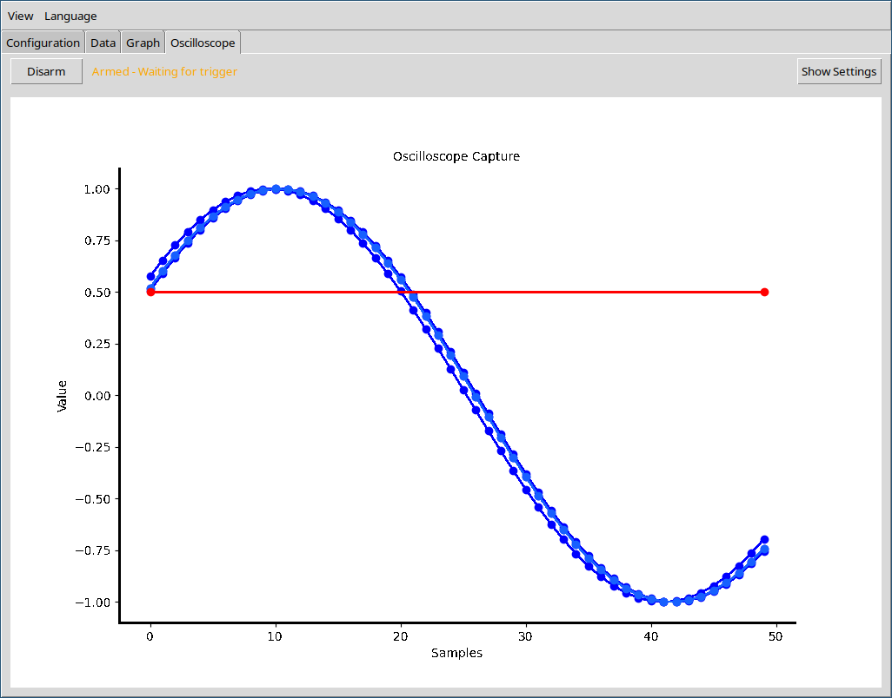
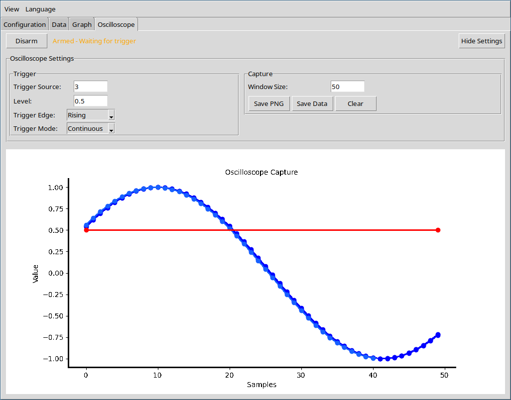

  <a href="index.md">Index</a> ·
  <a href="graph.md">Prev</a> ·
  <a href="index.md">Next</a>

# Oscilloscope

Implement oscilloscope trigger functions to detect and display signal events. Keep the last triggered waveform visible as a reference, and clearly indicate the trigger level on the plot.

## Settings

Fine-tune oscilloscope behavior to match your measurement needs. Adjust trigger settings to capture specific signal events, and configure display options to highlight important waveform features. Use persistence effects and reference traces to compare current and previous signals for more effective analysis.

### Trigger:

- Select the trigger **source** (column) to determine which signal initiates data capture.
- Choose the trigger **edge** (rising or falling) to specify the event type.
- Set the trigger **threshold** to define the level at which triggering occurs.
- Adjust trigger settings to ensure a stable and repeatable waveform display.
- Colors show current vs past windows for persistence‑like effect.

### Capture:

- Set the **window length** to control how many data points are captured after each trigger event.
- **Export** captured waveform data as plain text for further analysis.
- **Save** oscilloscope plots as PNG images for documentation or sharing.

  <a href="index.md">Index</a> ·
  <a href="graph.md">Prev</a>

